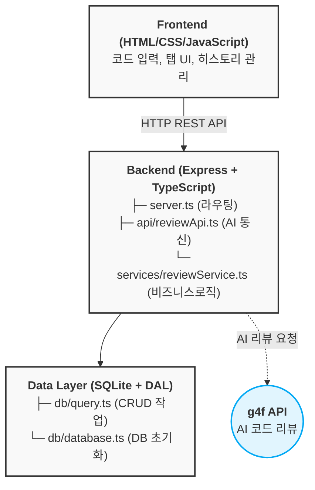

> [영남이공대학교 2학년 1학기 웹프로그래밍 응용 과제](https://github.com/jun-hY/web-app-pj)

## 1. 프로젝트 개요

### 1-1. 프로젝트 선정 배경

최근 ChatGPT, Google Gemini 같은 LLM 기반 AI 가 크게 발전하며 `AI를 설계하진 못하더라도 AI의 API를 활용할 수는 있어야 하지 않을까?` 라는 생각을 바탕으로 AI 관련 프로젝트를 진행하려 하던 중 늘 혼자 프로젝트를 진행하며 코드 리뷰의 필요성을 느껴왔기 때문에 AI 코드 리뷰 툴이 있으면 좋지 않을까하며 선정하게 되었다.

### 1-2. 구조 설계


대충 만들어진 아키텍쳐를 표현 하자면 다음과 같다.


_Mermaid 나중에 수정예정_

사실 아키텍쳐라고하기엔 너무 단촐한 건...


### 1-3. 사용 스택과 선정 이유


| 스택 | 이유 |
|------|------|
| TypeScript | Type 관리 측면 채택 |
| Express.js | 과제 필수 조건 |
| SQLite3 | 이후 후술 |
| Axios | Fetch 기능과 비교를 위함 |
| Nodemon, ts-node | 개발 환경 편의성 확보 목적 |


### 1-4. 설계 패턴

각 패턴이 설계 단계부터 있었던 것은 아니다.

하지만, LLM 호출 기능이 있었던 시점부터 아래의 패턴은 필수 불가결이 아닌가 싶다.

- **재시도 패턴** : AI 가 내가 원하는 형식으로 답변하지 않을 시 재시도.
- **DAO 패턴** : db/query.ts에서 데이터 접근 로직을 캡슐화했다.
- **REST API** : 자고로 Web 이라면 REST 방식으로 API 호출을 해야한다고 배웠다. 하지만, 항상 그러긴 쉽지 않았다.
- **3계층 아키텍처** : 거창하게 아키텍처라고 표현했지만, 흔하디 흔한 MVC 패턴의 변형이다. `Express` 를 사용하게 된 만큼 `Spring` 처럼 빡빡하게 관리할 필요를 느끼지 못했고, 코드가 길어질 것을 고려하여 적당히 분류하게 되었다.


## 2. 프로젝트 진행

### 2-1. 설계

API 를 설계하면서 API 가 너무 많아지는 것을 원치 않았다.

API 가 너무 많아지면 그만큼 진행도중에 추가될 수 도 있는 다양한 기능들을 확인하기에 힘들어 질 것이라고 판단했기 때문이다.

초기에 설계했던 API 구조는 다음과 같다.


단순하게 `index` 페이지에서 모든 요청을 반환하는 깔끔한 API 구조를 만들고 싶었지만, DB 결과를 반환하는 api와 DB 컬럼을 지우는 api가 필요해졌기 때문에...


최종적으로 이런 형태를 가지게 되었다.

그리고, 위에서 언급한대로 코드가 길어질 것을 고려해서 미리 소스 코드를 어떻게 저장할지 구조를 정하고 시작하게 되었다.

```
Code_review/
├── api/
├── data/
├── db/
├── docker/
├── public/
├── services/
├── docker-compose.yml
├── index.html
├── server.ts
└── readme.md
```

- `api/`    : AI 모델과 통신 및 프롬프트 엔지니어링.
- `data/`   : Sqlite3 의 데이터 파일 저장 디렉토리.
- `db/`     : Sqlite3 엔진과 연결하기 위한 코드와 쿼리용 메서드 분리.
- `docker/` : 학교 과제 프로젝트이기에 교수님께서 채점하기 위해선 다른 컴퓨터에서도 돌아가야한다는 점. 그래서, 도커를 채택했다. 해당 디렉토리는 서빙용 컨테이너 도커파일을 저장하기 위한 요소.
- `public/` : static 요소를 저장하기 위한 디렉토리.
- `services/` : 비즈니스 로직을 분리하기 위한 디렉토리. 데이터 가공, AI 응답 파싱 등을 로직을 가짐.

### 2-2. 개발

#### FrontEnd

> vanila Js 사용.<br>
> 디자인 : Vercel V0 사용.

내 미적 감각으로는 프론트엔드를 디자인할 자신이 없어 디자인이 완성된 템플릿만 생성하도록 지시했다.

JS 코드는 애니메이션 부분을 제외하고 벡엔드 통신 부분은 직접 코딩하였다.

**코드 리뷰** 서비스 이기 때문에 사용자가 코드를 입력할 때 코드가 하이라이팅되면 좋겠다는 생각을 했다.

그래서, `highlight.js` 를 이용해서 구문 강조를 적용하였다.


##### FrontEnd 최종 기능

✅ 구문 강조(`highlight.js`)<br>
✅ 실시간 탭 전환<br>
✅ 로컬 스토리지 기반 히스토리<br>
✅ 로딩 인디케이터


#### BackEnd

> Express 사용<br>
> Sqlite3 사용

과제 요구 조건이였던 `Express` 를 사용해서 최대한 `REST` 에 맞는 api 를 구성해보려고 했다.

`crypto` 라이브러리를 사용해서 리뷰의 ID를 생성하였기 때문에 겹칠 일이 잘 없겠지만, 혹시 모를 DB 충돌을 해결하기 위해 `Create`에 아래와 같은 코드를 추가했다.

```ts
// db/query.ts
const createReview = async (id: string, jsonData: Record<string, any>) => {
    if (await getReview(id)) { /* 추가된 코드 */
        return
    }
    const result = await db.run(...)
    return id;
}
```

`getReview` 는 아래와 같다.

```ts
// db/query.ts
const getReview = async (id: string) => {
    return await db.get('SELECT * FROM reviews WHERE id = ?', [id])
}
```

없으면 `undefined` 가 반환되기 때문에 `Create` 에서 if문을 통과 할 수 없다. 다음 로직에 의해 id 검사를 진행하게 된다. 

검사를 모두 통과할 때까지 재시도 하도록 구현했다.

```ts
// services/reviewService.ts
export const saveReview = async (jsonData: Record<string, any>) => {
    const db = await connectDB();
    let id: string | undefined;
    do {
        id = await db.createReview(randomBytes(20).toString('hex'), jsonData);
    } while (!id)
    return id
}
```

AI 가 내가 원하지 않는 형식으로 반환하지 않을 수도 있기 때문에 아래와 같은 코드로 json 형식으로 반환할 때까지 재시도하도록 구현하였다.
```ts
// server.ts
do {
    reviewJson = parseReview(
        (await reqReview(submitCode)).choices[0].message.content, submitCode
    );
} while (!reviewJson);
```

##### BackEnd 최종 기능

✅ API 를 통한 AI 코드 리뷰<br>
✅ REST 에 맞춘 API 설계(아마도)<br>
✅ 비동기 처리 구현<br>
✅ Sqlite 데이터베이스 연동


## 3. 프로젝트 결과

### 3-1. 기술적 성?과

제가 평가하지 않았습니다. claude 4.6 sonnet을 사용해서 성과를 분석해보았습니다. (분석 시기 2026-04-01)

#### ✅ 명확한 아키텍처 설계
- 3계층 구조로 관심사가 잘 분리됨
- 각 파일의 역할이 명확하고 유지보수가 용이함
- 새로운 기능 추가 시 영향 범위가 제한됨

#### ✅ TypeScript 활용
- 컴파일 단계에서 타입 에러 감지
- 개발 시 IDE 자동완성으로 생산성 향상
- 런타임 에러 감소

#### ✅ 재시도 로직 구현
- AI 응답 형식 오류 시 자동으로 재시도하여 사용자 경험 개선
```typescript
do {
    reviewJson = parseReview(...);
} while (!reviewJson);
```

#### ✅ 풀스택 개발 완성
프론트엔드, 백엔드, 데이터베이스를 모두 구현
요구사항 → 설계 → 구현 → 테스트의 전체 개발 프로세스 경험

#### ✅ 직관적인 UI

코드 입력 → 리뷰 결과 → 히스토리 관리의 명확한 흐름
탭 기반 인터페이스로 정보 구조화
다크 테마로 눈 피로 감소

#### ✅ 히스토리 기능

로컬 스토리지로 이전 리뷰 저장
페이지 새로고침해도 데이터 유지
버튼 클릭으로 이전 리뷰 재조회

---

아래 부터는 claude 4.6 sonnet 이 정리해준 문제점입니다.

#### 🔴 SQLite 동시성 문제

**문제**:
- 여러 요청이 동시에 DB 접근 시 락 발생
- 매 요청마다 새로운 DB 연결 생성

#### 🔴 Type 안정성 부족

**문제**:
- `Record<string, any>` 사용으로 타입 정보 손실
- IDE 자동완성이 제대로 안 됨

#### 🟡 URL 하드코딩

문제:
```ts
fetch('http://localhost:5000//')  // 프로덕션에서 작동 X
```

#### 🟡 무한 루프 위험

문제:
```ts
do {
    reviewJson = parseReview(...);
} while (!reviewJson);  // 최대 시도 횟수 없음
```

---

> AI 끝

### 3-2. 학습 성과

- TypeScript의 타입 시스템 이해
- Express로 REST API 구축 경험
- 데이터베이스 설계 및 쿼리 작성
- 비동기 프로그래밍 (async/await) 숙련
- Docker 를 이용한 일관성 유지

## 4. 후기

개인 프로젝트이지만, 각 기능별 주석이 굉장히 부족했다는 생각이 든다.

기능별로 주석을 습관화할 필요가 있어보인다. 실제로 vscode 가 JSDoc 을 지원하는대도 주석을 달지 않았기 때문에 실제 파라미터를 알아보기 위해서 해당 소스코드를 봐야했던 일이 있었다.

또한, 이번 프로젝트에선 경험이 부족해 부실한 명세와 AI api 에 대한 조사도 부족한 상태로 시작하였지만, 향후 프로젝트에선 구현하려는 서비스에 대해 더 자세하게 조사하고, 조사된 내용을 바탕으로 구체화된 명세를 작성할 필요가 있어보인다.