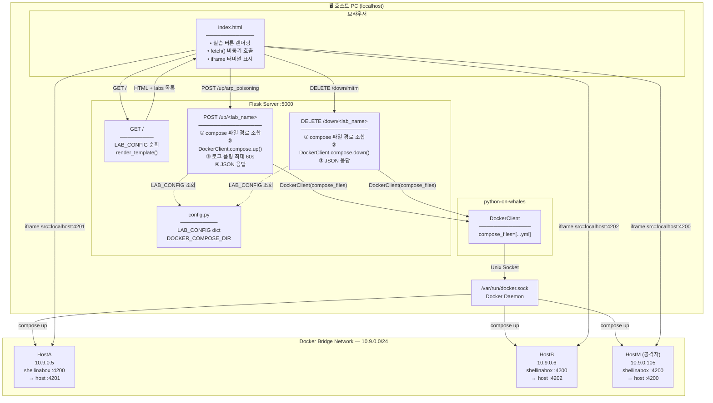

> [영남이공대학교 2학년 1학기 네트워크보안 과제](https://github.com/jun-hY/flask_network_lab)

## 1. 프로젝트 개요

### 1-1. 프로젝트 선정 배경

나는 작년 이맘때즈음 Pwnable을 공부하고 있었기 때문에 Docker 로 이루어진 SeedLabs의 실습환경에 크게 불편함이 없었다.

하지만, 조금의 편의성을 위해 실제 수업에서 진행한 실습환경과 다르게 내 실습 환경을 따로 개조해서 진행했었다.

수업에선 SeedLabs가 제공한 VM에서 Docker를 설치해 Vmware 환경에서 진행한 반면, 내 환경은 Wsl 이 이미 세팅된 상태였기 때문에 docker 만 설치하여 SeedLabs의 컨테이너를 설치해서 진행했다.

주변 동기들의 반응을 보았을 때, 네트워크 보안 시간에 실제 공격, 방어 실습보단 Docker에 대한 경험이 없어 SeedLabs 환경을 올리는데 시간을 더 오래쓰고 있었기 때문에 해당 프로젝트를 떠올리게 되었다.

### 1-2. 구조 설계

이번엔 Web 보단 시스템 파이프라인 구축에 중점을 둔 프로젝트였기 때문에, 많은 API가 필요하지 않을 것이라고 예상했다. 그래서 아래와 같이 설계하게 되었다.


_Mermaid가 너무 작게 렌더링되서 확대해서 보는 것을 추천_

### 1-3. 사용 스택과 선정 이유

|스택|이유|
|----|----|
| Flask | python으로 간단한 BackEnd를 설계하기 위함 |
| jinja2 | Flask 기본 제공 템플릿 엔진 |
| Python On Whales | subprocess 를 사용하지 않고 Python으로 안전하게 Docker를 제어하기 위함 |
| shellinabox | Running 상태의 Container의 shell 을 웹 상으로 표현하기 위해 사용 |


이번 프로젝트에선 비즈니스 로직을 따로 분류하지 않았다. 그만큼 코드 자체는 짧았다.


## 2. 프로젝트 진행

### 2-1. 개발

#### FrontEnd

> Jinja2 템플릿 엔진을 이용한 index.html 구현

전 포스트에도 했던 말이지만, 프론트 디자인엔 도저히 자신이 없다.

이번에도 V0 를 이용해 프론트를 작성했다.

다만, 템플릿 엔진을 사용하여 따로 js 를 작성할 필요가 없었기 때문에 프론트에선 내가 한 건 없다.


#### BackEnd

> Flask 를 이용한 REST Api 구축

api는 index, up, down 3가지로 각 api 별로 화면 렌더링, 도커 컨테이너 up, 도커 컨테이너 down 3가지 역할로 구성되었다.

`index` 페이지에선 미리 정의해놓은 실습 목록을 읽어와 실습 환경을 구동할 수 있는 버튼을 렌더링 해준다.
```python
@app.route('/')
def index():
    labs = []
    for lab_name, config in LAB_CONFIG.items():
        lab_info = {
            'name': lab_name,
            'description': config['description'],
            'roles': config['roles'],
        }
        labs.append(lab_info)

    return render_template('index.html', labs=labs)
```

`up/<lab_name>` 으로 비동기 요청을 전송하면 아래 코드에 의해 lab_name에 해당하는 실습을 실행시키게 된다.
```python
@app.route('/up/<lab_name>', methods=['POST'])
def up(lab_name):
    // 없는 실습 환경에 대한 요청
    if lab_name not in LAB_CONFIG:
        return jsonify({'error': '실습 항목을 찾을 수 없습니다.'}), 404
    
    // 실습 환경에 대한 정보 LOAD
    config = LAB_CONFIG[lab_name]
    
    // docker-compose 파일 찾기
    compose_file = DOCKER_COMPOSE_DIR / f"docker-compose-{lab_name}.yml"
    if not compose_file.exists():
        return jsonify({'error': 'docker-compose 파일을 찾을 수 없습니다.'}), 404
    
    // python on whales 를 통한 실습환경 실행
    docker = DockerClient(compose_files=[compose_file])
    docker.compose.up(
        detach=True
    )
    

    return jsonify({'message': '랩 환경이 시작되었습니다.', 'description': config['description']})
```

하지만, 위 코드로는 container 실행이 다 될 때까지 얼마나 걸릴 지 알 수 없다. 그리고, shellinabox 가 로드되지 않은 상태로 렌더링되기 때문에... 아래와 같은 코드를 추가했다.

```python
    start_time = time.time()
    
    while (start_time + 60 > time.time()):
        cnt = 0
        for role in config['roles']:
            if 'spawned: \'shellinabox\'' in docker.compose.logs(role):
                cnt += 1
        if cnt == len(config['roles']):
            break
        time.sleep(.2)
```

shellinabox 가 실행될 때 까지 기다리도록 했다.

`down/<lab_name>` 을 통해 현재 실행 중인 실습 환경을 종료할 수 있도록 했다.

```python
@app.route('/down/<lab_name>', methods=['DELETE'])
def down(lab_name):
    // 현재 실습환경이 없는 경우에 대한 예외처리
    if lab_name not in LAB_CONFIG:
        return jsonify({'error': '실습 항목을 찾을 수 없습니다.'}), 404
    
    // docker-compose 파일 탐색
    compose_file = DOCKER_COMPOSE_DIR / f"docker-compose-{lab_name}.yml"
    if not compose_file.exists():
        return jsonify({'error': 'docker-compose 파일을 찾을 수 없습니다.'}), 404
    
    // container 종료
    docker = DockerClient(compose_files=[compose_file])
    docker.compose.down()
    
    return jsonify({'message': '랩 환경이 종료되었습니다.'})

```


#### Infra

각 실습 별로 컨테이너에 `shellinabox` 패키지가 설치되어야 하기 때문에 자동화 스크립트를 하나 작성하여 각 컨테이너가 스크립트를 실행하도록 SeedLabs의 docker-compose 파일을 수정해줬다.

**init.sh**
```sh
# apt-get update
apt-get update

# shellinabox 설치
apt-get install -y shellinabox
```

**각 실습 docker-compose 파일**
```yaml
services:
    HostA:
    # .. 중략 .. 
        command: bash -c "/etc/init.d/openbsd-inetd start && /init.sh && tail -f /dev/null"
```

하지만, 당시엔 이렇게 실행이 되지 않았다. 우분투 아카이브 서버가 죽어있었다.

찾아보니 우분투의 기본 아카이브가... 꽤나 불안정적이라는 얘기가 항상 들려온 관계로 아래와 같이 패키지 아카이브를 변경해 주었다.

**init.sh**
```sh
# archive 서버 변경
sed -i 's|http://archive.ubuntu.com|http://mirror.kakao.com/ubuntu|g' /etc/apt/sources.list
sed -i 's|http://security.ubuntu.com|https://security.ubuntu.com|g' /etc/apt/sources.list
```

또한, `shellinabox` 이 친구가...

어떤 패키지라도 그렇겠지만, 설치한다고 바로 daemon으로 올라가 실행되지 않는다.

무엇보다, docker image 는 경량화를 위해 따로 systemd 같은 데몬 관리 프로그램들이 올라가지 않는다.

그래서 경량화 유지 및 패키지 데몬 실행 목적으로 `supervisord` 를 설치하고, daemon으로 등록해주었다.

```sh
# supervisor 설치
apt-get install -y supervisor

# shellinabox supervisor 설정 생성
echo '[program:shellinabox]
command=/usr/bin/shellinaboxd --no-beep -t --user=root --group=root -s /:root:root:/:/bin/bash
autostart=true
autorestart=true
startsecs=5
stdout_logfile=/var/log/shellinabox.out.log
stderr_logfile=/var/log/shellinabox.err.log
' > /etc/supervisor/conf.d/shellinabox.conf

# supervisorctl shellinabox 실행
exec /usr/bin/supervisord -n
```

`python-on-whales` 이 친구도 문제였다.

기존 데스크탑과 노트북에 설치되어있던 `python 3.12` 로 설치했더니 의존성 에러가 자꾸 발생하는 것이 아닌가.

찾아보니 그 깨진 의존성이 `python 3.11` 에 존재했던 것이였다...

그래서, 실행의 간편성의 위해 batch 파일도 작성해서 `python 3.11` 버전 설치 확인 및 설치, 웹 서버 실행을 위한 venv 생성 및 의존성 설치, 웹 서버 실행을 자동화했다!

python 홈페이지에 `winget` 으로 다운이 가능한 것을 보고 영감을 얻어 AI를 사용해서 자동화 스크립트를 작성하였다.

**run.bat**
```bat
Rem 긴 스크립트이니 나머지는 repository 방문해서 봐주세요

ECHO [INFO] 필요한 패키지를 설치합니다...
python -m pip install -r requirements.txt

ECHO [INFO] 서버를 시작합니다...
python app.py

if errorlevel 1 (
    ECHO [ERROR] 오류가 발생했습니다. 아무 키나 누르면 종료됩니다...
    pause
)
```

docker-compose 파일에 대한 것은 `init.sh` 를 실행시키는 커멘드를 제외하면 SeedLabs의 실습 파일을 그대로 사용한다.

## 3. 프로젝트 결과

### 3-1. 기술적 성?과

이전 포스트와 같이 내가 내 프로젝트를 평가하진 못하기 때문에 이번에도 Claude 4.6 sonnet에게 평가를 맡겨보았다.

*ai 답변 시작*

#### 아키텍처 및 기술적 성과 (Technical Achievements)

✅ 컨트롤 플레인과 실행 환경의 명확한 분리

Flask 웹 서버를 오케스트레이션 레이어(control plane)로, Docker Compose를 실제 네트워크 시뮬레이션 레이어(data plane)로 분리한 구조는 책임(Separation of Concerns)이 명확하다. 

app.py가 컨테이너 생명주기만 관리하고, 실제 네트워크 토폴로지는 Compose 파일에 완전히 위임되어 있어 두 레이어가 독립적으로 변경 가능하다.

✅ 데이터 기반 실습 구성(Data-driven Lab Configuration)

config.py의 LAB_CONFIG 딕셔너리 구조는 새로운 실습 시나리오를 추가할 때 config.py와 Compose 파일만 작성하면 되는 구조를 만든다. 

웹 UI는 해당 설정을 동적으로 렌더링하므로, 라우팅 로직이나 프론트엔드 코드를 건드릴 필요가 없다.

✅ shellinabox 레이스 컨디션의 능동적 해결

컨테이너 기동 직후 shellinabox가 완전히 준비되지 않은 상태에서 iframe이 로드되던 문제를 로그 기반 폴링으로 해결한 점은 주목할 만하다.
```python
# app.py:40-47
while (start_time + 60 > time.time()):
    cnt = 0
    for role in config['roles']:
        if 'spawned: \'shellinabox\'' in docker.compose.logs(role):
            cnt += 1
    if cnt == len(config['roles']):
        break
    time.sleep(.2)
```

'spawned: \'shellinabox\'' 로그 문자열을 감지하는 방식은 shellinabox의 실제 시작 신호를 정확히 포착하며, 단순한 sleep() 대비 환경에 따른 편차를 줄인다.

✅ 현실적인 네트워크 토폴로지 시뮬레이션

각 컨테이너에 10.9.0.0/24 서브넷 내 정적 IP를 부여하고, 역할별로 HostA(Server), HostB(Client), HostM(Middle) 명명 체계를 일관되게 적용한 것은 실제 네트워크 공격 시나리오를 충실히 재현한다. 

SEED Lab 이미지(handsonsecurity/seed-ubuntu:large) 활용으로 실습에 필요한 도구 사전 구성 비용을 제거했다.

✅ Windows 환경 완전 자동화

run.bat은 단순한 실행 스크립트를 넘어, Python 3.11 존재 여부 확인 → winget을 통한 자동 설치 → 가상환경 생성 → 의존성 설치 → 서버 기동까지의 전체 플로우를 처리한다. 

이는 실습 환경에 대한 사전 지식이 없는 수강생도 run.bat 하나만 실행하면 된다는 점에서 강의 운영 비용을 실질적으로 낮춘다. Python 3.12와의 의존성 충돌을 Python 3.11을 명시적으로 핀(pin)하는 방식으로 해결한 것도 실용적인 판단이다.

#### 설계 및 구현 상의 한계와 개선점 (Areas for Improvement)

🔴 로그 문자열 파싱의 취약성

shellinabox 준비 완료 여부를 'spawned: \'shellinabox\'' 문자열 포함 여부로 판단하는 방식은 shellinabox 버전 업그레이드나 로그 포맷 변경 시 조용히(silently) 실패할 수 있다. 이 경우 60초 타임아웃 후 정상 기동 여부와 무관하게 응답을 반환하게 된다.
```python
# app.py:43
if 'spawned: \'shellinabox\'' in docker.compose.logs(role):
    cnt += 1
```

🟡 하드코딩된 포트 레이아웃과 UI의 결합

프론트엔드의 `updateAllShells()` 함수는 항상 포트 4200부터 순차적으로 3개의 iframe을 렌더링한다. 
```js
// templates/index.html:272
function updateAllShells(description = null) {
    const shells = document.querySelectorAll('.shell-container');
    if (currentPractice) {
        let port = 4200;
        shells.forEach(shell => {
            // ...
        });
        document.querySelector('.description-content').innerHTML = `<p>${description}</p>`;
    } else {
        let num = 1;
        shells.forEach(shell => {
            // ...
        });
        document.querySelector('.description-content').innerHTML = ``;
    }
}
```


실제 활성 컨테이너 수는 LAB_CONFIG의 roles 길이에 따라 달라질 수 있으나, UI는 이를 반영하지 못한다. 현재는 두 실습 모두 3개의 컨테이너(HostA, HostB, HostM)를 사용하므로 문제가 없지만, 컨테이너 수가 다른 실습 모듈 추가 시 반드시 수정이 필요한 지점이다.

🟡 런처의 Windows 전용성

run.bat은 `%LOCALAPPDATA%\Programs\Python\Python311\python.exe`라는 Windows 특정 경로에 의존한다. 

macOS나 Linux에서 동일한 편의성을 제공하는 동등한 셸 스크립트가 없어, 비Windows 환경 수강생은 별도의 수동 설정 절차를 따라야 한다.

#### 향후 고도화를 위한 제언 (Future Work)

🛠️ 비동기 컨테이너 상태 알림 도입

현재의 동기식 폴링을 Server-Sent Events(SSE) 또는 WebSocket 기반의 비동기 알림으로 전환하는 것이 가장 효과적인 개선이다. 

Flask에서는 flask-sse 또는 단순한 스트리밍 응답으로 구현 가능하며, 프론트엔드는 진행 상황을 실시간으로 표시할 수 있다. 이를 통해 API 블로킹 문제와 UI의 로딩 불투명성을 동시에 해소할 수 있다.

🛠️ 셸 레이아웃의 동적 생성

config.py의 roles 목록을 API 응답에 포함하고, 프론트엔드가 이를 기반으로 iframe을 동적으로 생성하도록 변경하면, 컨테이너 수가 다른 신규 실습 모듈도 추가 UI 수정 없이 수용할 수 있다. 이는 현재의 데이터 기반 설계 철학을 UI 레이어까지 일관되게 확장하는 작업이다.

🛠️ 실습 모듈의 선언적 확장

현재 ARP Cache Poisoning과 MITM으로 구성된 실습 카탈로그를 ICMP Redirect, TCP SYN Flood, DNS Spoofing 등으로 확장하는 것은 기존 아키텍처 내에서 config.py 항목과 Compose 파일 추가만으로 가능하다.

이 구조적 장점을 살려 각 실습의 난이도와 선행 실습 관계를 LAB_CONFIG에 메타데이터로 추가한다면, 커리큘럼 순서를 UI에서 안내하는 학습 경로(learning path) 기능으로 자연스럽게 발전시킬 수 있다.

*ai 답변 끝*

사실 프로젝트가 강의에서 영감을 받았고 그 강의실의 pc가 모두 windows 운영체재를 사용하기 때문에 windows 전용성에 대해선 그렇게 까지 개선해야 되나? 싶긴하다.

하지만, 페이지를 렌더링할 때 쉘 개수가 3개로 고정인 점과 `flask-sse`를 통한 싱글 쓰레드 블록킹에 대한 해소는 충분히 개선여지가 있는 것 같다.

URL 하드코딩 또한, `python-dotenv` 패키지를 활용해서 작업했으면 가독성 측면에서도 더 편하지 않았을까 하는 생각이 든다.

### 3-2. 학습 성과

- 자동화 스크립트를 통한 실행 간편화 및 의존성 해결
- Flask 를 통한 Web Api 구현
- Docker와 Web의 연동 구현

## 4. 후기

`python-on-whales` 이 친구가 말썽이긴 했지만, docker의 새로운 사용법을 알게된 것 같아서 즐겁게 진행한 프로젝트였다.

원래는 shellinabox 가 아닌 `flask-sse` 를 사용해서 실시간 쉘을 구현하고 싶었지만 당시에는 구현에 실패했었는데 `flask-sse` 를 통한 웹소켓 구현을 다음 flask 프로젝트에도 적용시켜보면 좋을 것 같다.